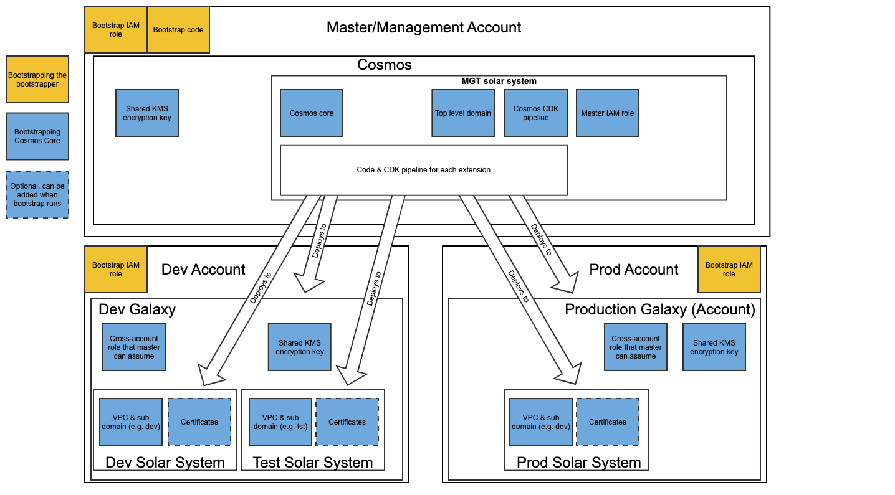

In the previous step, we bootstrapped the bootstrap code. This gave us IAM roles and a codebuild project, which we can now use to bootstrap Cosmos into the account defined in your bin/main.ts file.

To bootstrap your Cosmos core, run the below command in the base directory of your project:

`npx cdk --app “node_modules/@cosmos-building-blocks/common/lib/cdk-toolkit/bootstrap-app.js” deploy`

This will archive your current working directory and pass it as an asset to the CDK Toolkit s3 bucket in your master account, and trigger the CodeBuild job to bootstrap your Cosmos core or extension.

### What you'll get

_Sample Pattern with Management, Development & Production Accounts, with two Solar Systems in Dev (Dev & Test):_

- Cosmos resources 
    - tld (top level domain) e.g. devops.iagcloud.net
    - master role that creates resources and can assume cross-account roles to create resources in those accounts
- Pipeline to deploy new resources if needed (*pipeline naming structure*)

galaxy level
- if cross account, creates cross-account role that master can assume
- shared KMS encrytion key, can be used by solar systems to encrypt things

solar system
- vpc and subdomain (e.g. dev, tst, prd from tld)
- certificates (optional)

### Next Steps
Once you've bootstrapped your Cosmos core, you can use these resources within extensions to build out your apps.

## [Next Step: Deploying Cosmos Extension](getting_started_extension.md)
